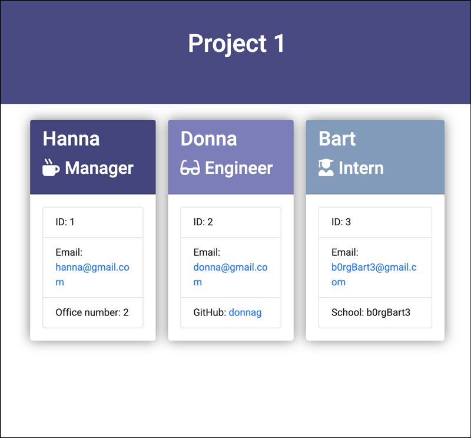

# Employee Summary
A Node CLI application that takes in information about employees for a project and generates an HTML webpage that displays summaries for each person. The user can input any number of team members, and they may be a mix of managers, engineers and interns.


# Table of contents
1. [Usage](#Usage)
2. [Live Demo](#Live_Demo)
3. [License](#License)
4. [Features](#Features)
5. [Technology](#Technology)
6. [Credits](#Credits)
7. [Tests](#Tests)
8. [Badges](#Badges)
9. [User Story](#User_Story)
<a name="Usage"></a>
## Usage
```sh
node app.js
```
<a name="Live_Demo"></a>
## Live Demo
output/index.html
<a name='License'></a>
## License
[](https://lbesson.mit-license.org/)
<a name="Features"></a>
## Features
1. any number of employees
<a name="Technology"></a>
## Technology
1. node js
2.  npm package: Inquirer
3.  npm package: Jest (for testing)
4.  HTML
5.  CSS
<a name="User_Story"></a>
## User Story
```sh
As a manager I want to generate a webpage that displays my team's basic info so that I have quick access to emails ang GitHub profiles
```
<a name="Tests"></a>
## Tests
passed unit test: Employee.test.js, Engineer.test.js, Intern.test.js, and Manager.test.js

<a name="Credits"></a>
## Credits
b0rgBart3@gmail.com

<a name="Badges"></a>
## Badges
 [](https://shields.io/)

**on github:** <a href='github.com/b0rgBart3'>b0rgBart3</a>

[](https://github.com/remarkablemark)

Email: borgBart3@gmail.com
